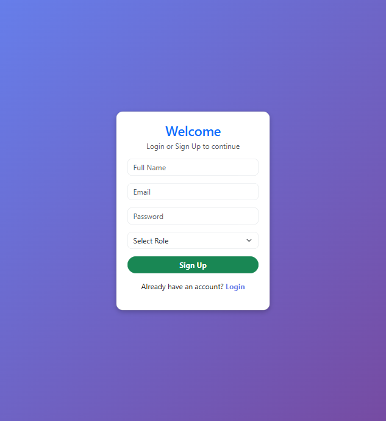
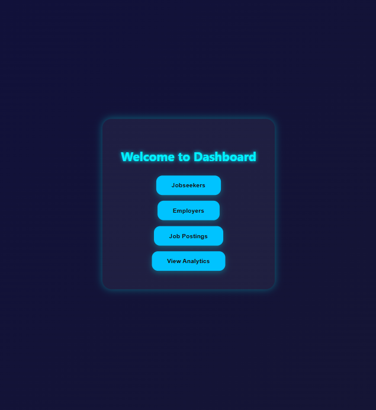
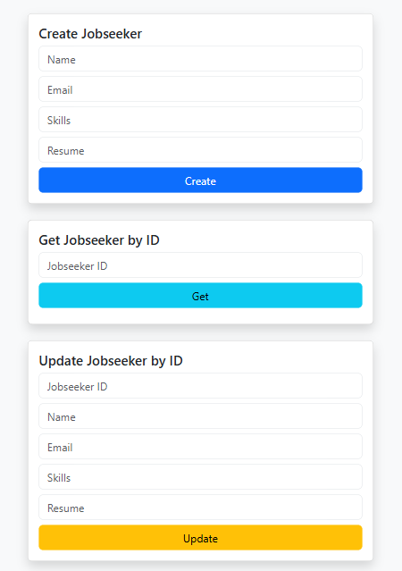
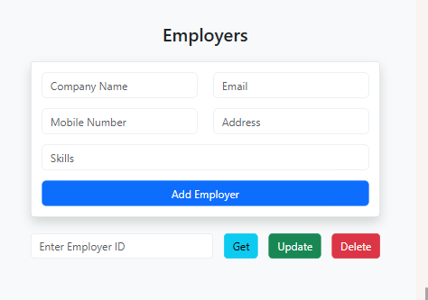
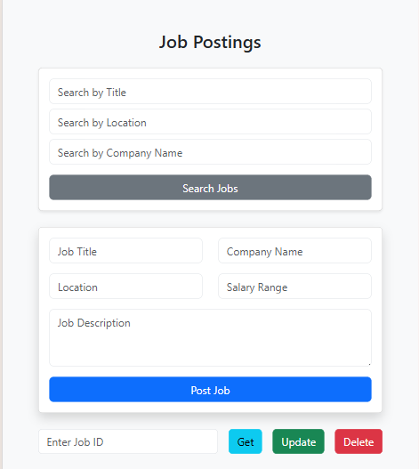
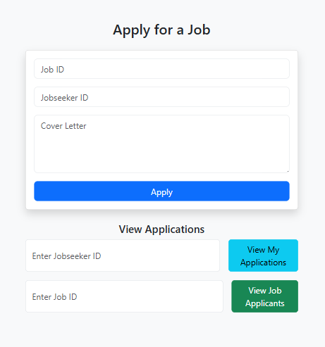

# 💼 Job Board Application

A full stack **Job Board Web Application** where employers can post job openings and job seekers can apply for jobs.  
The platform includes job posting management, employer management, job seeker profiles, and job application tracking.

This project mainly focuses on **backend development and REST API architecture**, while the frontend is implemented using **HTML, CSS and JavaScript** for a simple and clean interface.

---

# 🚀 Features

### 🔐 Authentication
- User Sign Up
- User Login
- Role based access (Employer / Jobseeker)

### 👤 Jobseeker Management
- Create jobseeker profile
- Get jobseeker by ID
- Update jobseeker details
- Store skills and resume information

### 🏢 Employer Management
- Add employer
- Get employer details
- Update employer details
- Delete employer

### 📄 Job Posting
- Post a new job
- Update job details
- Delete job
- Fetch job by ID

### 🔍 Job Search
- Search jobs by title
- Search jobs by location
- Search jobs by company name

### 📩 Job Applications
- Apply for jobs
- View applications
- View applicants for a job

### 📊 Dashboard
- Central dashboard for navigation
- Access Jobseekers
- Access Employers
- Access Job Postings
- View Analytics

---

# 🛠️ Tech Stack

## Frontend
- HTML
- CSS
- JavaScript

## Backend
- Node.js
- Express.js

## Database
- MongoDB

---

---

# 📸 Application Screenshots

## Login Page

---

## Sign Up Page

---

## Dashboard

---

## Jobseeker Management

---

## Employer Management

---

## Job Postings

---

## Job Application

---

# ⚙️ Installation & Setup

### 1️⃣ Clone the repository
git clone https://github.com/your-username/job-board.git
cd job-board
---
### 2️⃣ Install dependencies
npm install
---
### 3️⃣ Configure environment variables
Create a `.env` file
PORT=5000
MONGO_URI=your_mongodb_connection_string
---
### 4️⃣ Run the server
http://localhost:5000

---

# 🔗 API Endpoints

## Jobseeker

| Method | Endpoint | Description |
|------|------|------|
| POST | /jobseeker | Create jobseeker |
| GET | /jobseeker/:id | Get jobseeker |
| PUT | /jobseeker/:id | Update jobseeker |

---

## Employer

| Method | Endpoint | Description |
|------|------|------|
| POST | /employer | Add employer |
| GET | /employer/:id | Get employer |
| PUT | /employer/:id | Update employer |
| DELETE | /employer/:id | Delete employer |

---

## Jobs

| Method | Endpoint | Description |
|------|------|------|
| POST | /jobs | Post job |
| GET | /jobs | Get all jobs |
| GET | /jobs/:id | Get job |
| PUT | /jobs/:id | Update job |
| DELETE | /jobs/:id | Delete job |

---

# 📈 Future Improvements

- JWT Authentication
- Resume file upload
- Job recommendations
- Pagination
- Advanced job filtering
